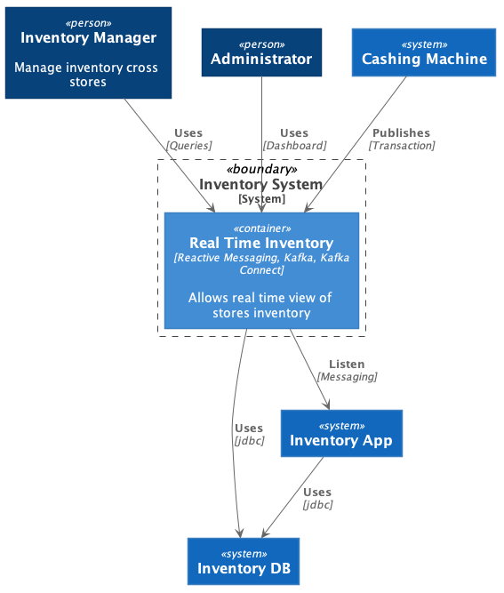
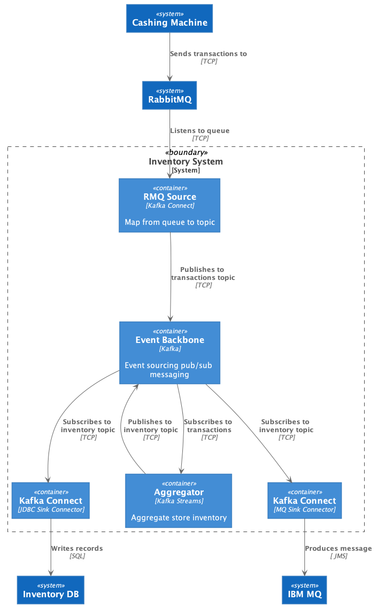

# Kafka Connect with Event Streams on Cloud

This repository includes a set of component to demonstrate some of the Kafka Connect connectors from the IBM Event messaging team.

We are using a classical, yet simple implementation of item consumption in store and centralized inventory using a simple real time streaming solution instead of batch based approach, as a lot of distribution industry companies are using today.

The system context looks like:



And the component view looks like:



See the [lab instructions](https://ibm-cloud-architecture.github.io/refarch-eda/technology/event-streams/kconnect/) in the EDA main repository for a step by step tutorial.

## Pre-requisites

The goal is to run all those components on an OpenShift cluster and use Cloud Pak for integration event streams and MQ instances.

For a solution running most of the component locally with Event Streams on Cloud, see the [lab instructions](https://ibm-cloud-architecture.github.io/refarch-eda/technology/event-streams/kconnect/) in the EDA main repository for a step by step tutorial.

## Build and run locally

We are providing docker compose files and maven pom to build and run the components locally for development purpose.

### Build

Do the following within this folder:

```shell
mvn build
```

### Run locally

Under the infrastructure folder:

```shell
docker-compose up & 
```

